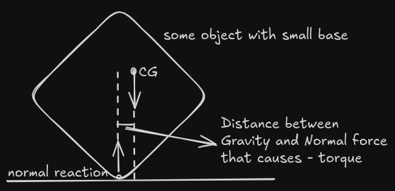
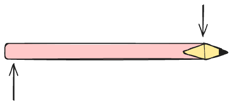

I think, [**Gyroscopes**](https://en.wikipedia.org/wiki/Gyroscope) are cool,
They stand and balance themselves when provided with angular momentum but fall
over when standing still, just like cycle (Though their mechanism is quite
different). For long time, I didnt understand how it worked, Why do rotating
things seem to balance themselves? It shouldn't right? You have a top and place
it, it falls due to effects of gravity. Makes sense. Now you give it some
angular momentum and it stands? For any sane person this shouldn't make sense.
Yet, this is how the universe functions.

For past few weeks I was obsessed over it. This writing is my attempt at
explaining why spinning things don't fall. I hope I help you understand this
phenomenon too.

## Why do Objects Tip Over?

On a normal object, [Gravity](https://en.wikipedia.org/wiki/Gravity) applies a
force downwards at every point on the body. But, if only gravity acted on the
body then the body would be falling in free motion. But that is not the case,
The body infront of you is perfectly still. That is because, the earth too is
applying a force whose magnitude is equal to gravity but opposite in direction.

_Fine! This explains why the bodies don't fall continuously but I asked why
objects don't tip over!_

I hear you and trust me there is a good reason for that.

For mathematical simplicity, lets assume that the body is rigid (ie. each
particle in the body is in fixed position relative to each other.), is on earth
and is small in size, then we can assume that gravity is being applied at the
body's [Center of Mass](https://en.wikipedia.org/wiki/Center_of_mass). But earth
can apply normal force to the body only where it touches the surface. In our 
simplified model, we assume that the body is toughing earth at a single point. 

In the above (exaggrated) diagram above, you can see that there is a small gap
between the vectors of gravity and normal. Now, lets digress here for a bit and
imagine that you pencil sitting flat on a table and you want to rotate it. You
are only allowed to use 2 of the fingers to rotate it. What will you do? You will
intuitively push the opposite ends of pencil in opposite direction. As in diagram
below,

Now, Instead of pencil its our rhomboidal object and instead of your hands its
force from gravity and normal reaction from earth. But they are essentially
equal and opposite forces seperated by a distance between them. In physics, we
call this torque. and a [Torque](https://en.wikipedia.org/wiki/Torque) is necessary 
to make the objects rotate. 

[Couple](https://en.wikipedia.org/wiki/Couple_(mechanics)) and applies torque on
the object.

The above diagram is exagrated, the couple doesn't need to be that large. Even a
tiniest of microscopic couple can tilt the object slightly. And this tilt will
increase the distance between CoM and PoC. Which causes more couple and then
more tilt and so on...

This is why when objects start tipping over they start very slow.

## How does spinning prevent gravity from applying torque?

To understand this, we need to understand a forces on spinning object. To keep
things simple, let's assume our object in question is a spinning top with no
moving parts. ie. It's single body. and has a center of gravity very minutely
off the center.

Now, let's observe the forces on this top's CoG at T=0, when the top has just
started spinning.

## More Learning and Resources

1. [VSauce Video on Gyroscopes](https://www.youtube.com/watch?v=XHGKIzCcVa0)
