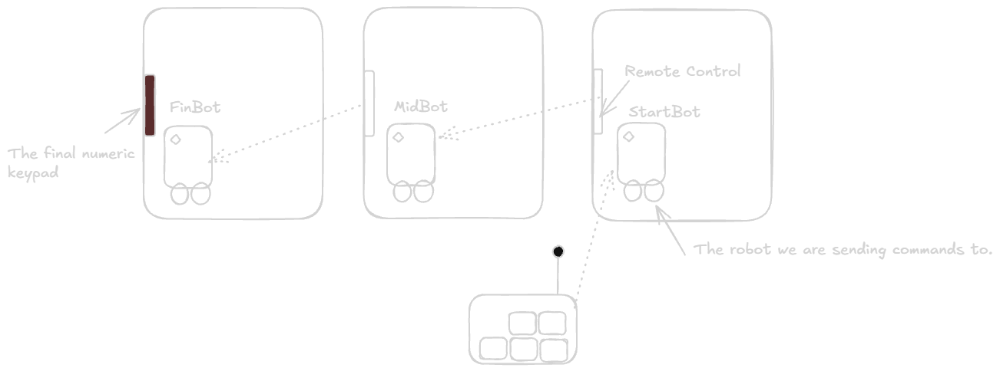

Advent of Code 2024 was a really interesting one, the variety of problems was
wider than the ones in previous editions. Also, it was the first AoC challenge
I completed to the end and earned 50 stars. Among all the problems, I found the
problem on [Day 21](https://adventofcode.com/2024/day/21) most challenging.
therefore, I am writing this detailing my approach to solving this problem.

## What the problem asks

To put it mathematically, The problem gives multiple layers. and at each layer a
the input of previous layer is transformed (expanded) and this expanded output
is the input for another layer. But, there can be multiple expansions that are
valid. and the goal is to find the length of smallest valid transformation.

### generic psuedocode

```python
class Input: ...

def expand(i: Input) -> set(Input): ...

res: set[Input] = set(Input(...))
for _ in range(LAYERS):
    next_res = set()
    for i in res:
        next_res |= expand(i)
    
    res = next_res

return min(len(i) for i in res)
```

## Understanding the "Rules of Expansion"

In the first part of the problem, it is given that there are 3 robots
controlling the one infront of it, As shown in diagram below:



And each robot is typing into the keypad infront of it. And here is how each one
is controlled:

1. Each robot's arm is initially at `A` button.

2. Each robot needs to be provided with the exact instructions to move its arm
as follows:
    - `^`: move arm 1 key up
    - `>`: move arm 1 key right
    - `<`: move arm 1 key left
    - `v`: move arm 1 key down
    - `A`: press the key under the arm

3. Arm cannot move over the *hole* or *blank space*

4. `FinBot` is controlling **numeric keypad** as shown below:

    ```txt
    +---+---+---+
    | 7 | 8 | 9 |
    +---+---+---+
    | 4 | 5 | 6 |
    +---+---+---+
    | 1 | 2 | 3 |
    +---+---+---+
        | 0 | A |
        +---+---+
    ```

    Whereas other bots are controlling **directional keypad**:

    ```txt
        +---+---+
        | ^ | A |
    +---+---+---+
    | < | v | > |
    +---+---+---+
    ```

From the given rules, we can start working on `expand` function:

Lets say the `FinBot` wants to type in `540A`,

To do this, the arm of FinBot should reach the keys in following order: A - 5
\- 4 - 0 - A.

Now, Lets take the first step: going A - 5:

the key `5` is 1 step left and 2 step above the key `A`. So, given that the arm
can move only in 4 directions, The least number of steps required will be equal
to the [Manhattan Distance](https://en.wikipedia.org/wiki/Taxicab_geometry)
between the two.

Any other path taken will always contain 2 Up and 1 Left. So, I can safely
eliminate the paths that are more than 3 steps. This can be proven mathematically
by [Graph Theory](https://en.wikipedia.org/wiki/Graph_theory). But one can also
understand it intuitively using [Vectors][1].

[1]: https://en.wikipedia.org/wiki/Vector_%28mathematics_and_physics%29

### improvised pseudocode for part 1

Now that we know the exact rules we can improvise our original psuedocode:

```python
class Keypad(): ...

numeric_keypad = Keypad(...)
directional_keypad = Keypad(...)

def expand(i: str, keypad: Keypad) -> set[str]: ...

res: set[str] = expand("313A", numeric_keypad)
for _ in range(3):
    next_res = set()
    for i in res:
        next_res |= expand(i, directional_keypad)
    
    res = next_res

return min(len(i) for i in res)
```

## Finding the shortest route

The shortest signal the `MidBot` sends has to be combination of 2 Up and 1 Left
and `A` at the end to press the button: `<^^A`, `^^<A` or`^<^A`.

For a moment, lets not consider the rule 3. Can one eliminate something among
these?

Maybe one can? Lets first consider the set of motions that `MidBot` needs to do
for all three shortlisted options:

1. `^^<A`: `A` to `^` - Press Twice - `^` to `<` - Press Once - `<` to `A` -
Press Once
2. `<^^A`: `A` to `<` - Press Once - `<` to `^` - Press Twice - `^` to `A` -
Press Once
3. `^<^A`: `A` to `^` - Press Once - `^` to `<` - Press Once - `<` to `^` -
Press Once - `^` to `A` - Press Once

Wait! If you observe carefully, the motions of option 3 contains motion of both
option 1 and 2! that means motions of option 3 is superset of both option 1 and
option 2.

To first understand why option 3 is superset. One needs to recognize:

> Motions are reversible.

The motion from `A` to `<` has the same steps as `<` to `A`. just in reverse
order.

and given that to reach from any key`x` to key `y` requires movement in only 2
direction: **Horizontal** and **Vertical** any motion can be divided into few
sets of motion.

In this case, all the possible motions are composed of following 3 sets of sub
motion:

1. `motion(A, <)`
2. `motion(A, ^)`
3. `motion(<, ^)`

In the best case scenario, all the 3 required motions will be used only once.
and in any other case, a set of motion will be repeated.

If we observe, in case 1 and 2, the keys are grouped together and therefore need
to move only once from directional key to another directional key. whereas in
option 3 `motion(<,^)` is required twice. And this is true irrespective of shape
of keypad.

This tells us something important:

> If a grouped path exists, then it will be subset of all ungrouped ones and
thus the shorter one.

With this knowledge one can simplify choices to following:

1. Move Vertically, then Move Horizontally
2. Move Horizontally, then Move Vertically

further, if any of the `Input` requires robot to move its arm over the *hole*
then that option can be eliminated.

For part 1, I simply did brute force expansion. and found the minimum length
among all the valid solutions. While this naive approach worked for part 1. in
part 2 there are 25 robots in chain! and seeing that the solution expands
exponentially (napkin math says length of solution is approx k*2^n, where `k` is
length of initial `Input` and n is number of layers).

## [Dynamic Programming][2] Solution

[2]:https://en.wikipedia.org/wiki/Dynamic_programming

Brute force was not going to work for Part 2. I would need super computer to
work with strings that large.

### Reducing Information

But wait! This problem only asked me to find length of smallest string, not the
exact string. This could mean:

> I am storing and working with more information than needed.

This means, the result of each transformation doesn't need to be set of entire
strings. strings contain a lot of information that is unnecessary to solve this
problem.

Consider 3 robots in chain `A`, `B`, `C`. A possible control signals of these
robots following the established rules are given below:

```txt
A: 540
B: (^^<A | <A | >vvA)
C: (<A | A | v<A | >>^A) | (v<<A | >>^A) | (vA | <A | A | ^>A)
```

Consider the expansion of first character `5 :: ^^<A :: <A | A | v<A | >>^A`.

Lets see where the arms of each robot is initially and after the key `5` is
pressed by robot `A`:

```txt
A: A -> 5
B: A -> A
C: A -> A
```

Observe that after each key press of Robot `A`, the arms of robot `B` returns
back to the key where it started. And similarly after every character of robot
`B` arms of `C` return back. Since the rules are symmetric for all *layers*,
this pattern will continue forever.

Now, when we are computing expansion of next character of Robot `A` ie. `4`, the
arm of all the robots above in the chain are already on their *home* key A, as
if they had never moved before.

This means, expansion of a *chunk* of command by `B` like `^^<A` is dependent
only in itself. Not what comes before it or after it. This implies:

> Cost of executing *chunk* of command is dependent only on itself.

Combining the above disovery with the fact that addition is an [Commutative][3]
property, all we need to store is a `map` or `dict` of *chunk* and no. of times
it occurs. This provides enough data for next layer to expand upon.

[3]:https://en.wikipedia.org/wiki/Commutative_property

### Computing Expansions

The `directional keypad` that robots are controlling is very small, with height
of 2 keys and width of 3. which means, any *chunk* consist of following:
`0-1 step vertically` and / or  `0-2 steps horizontally` + ending `A`

And after removing duplicates, we are left with only 23 possible *chunks* as
follows:

```txt
"A", ">A", ">^A", ">vA", "^>A", "v>A", ">>A", "^>>A", "v>>A", ">>^A", ">>vA", 
"<A", "<^A", "^<A", "v<A", "<vA", "<<A", "^<<A", "v<<A", "<<^A", "<<vA", "^",
"v"
```

Entire command is just combination of these 23 small *chunks* Irrespective of at
which layer the robot is sitting.

In my approach, I first precomputed optimal expansions and hardcoded those in
the source code of my program.

I did some permutation and combination and realized that expanding each *chunk*
twice gave me a clear answer for which expansion was the most optimal. While
I do not have definite "math" for why it works. But I believe it works because,
expanding twice is enough to give me expansions of different length.

Here is the [code][4] I used to find the expansions, Its not the best but its
readable enough.

[4]: https://github.com/pranavtaysheti/advent-of-code/blob/main/2024/21/generate/expansions.py

### improvised pseudocode

```python
type Command = dict[str, int]

class Keypad(): ...

numeric_keypad = Keypad(...)
directional_keypad = Keypad(...)

# hardcode pre-computed expansions in this function
def expand(i: Command, keypad: Keypad) -> Command: ...

def cost(i: command) -> int: ...

res: Command = expand({"313A": 1}, numeric_keypad)
for _ in range(25):
    res = expand(res)

return cost(res)
```

And the last part is generating a new `Command` at each layer using pre computed
expansions and then calculate the `Cost` of the `Command` we arrive at after `N`
layers.

Here is my solution I used to solve this problem: [code][5]

[5]: https://github.com/pranavtaysheti/advent-of-code/blob/main/2024/21/go/main.go

This approach solves P2 in just few ms in my go solution. and perhaps it can
solve the problem with way more layers. but at that point you should be more
worried about hitting limits of `int64`.

### Big O Notation

Each expansion step operates over a `map` whose maximum size is 23 for the given
keypad. which is practically constant time. `expand` function is called once at
every *layer* so the big O notation is: **O(L)**

where, L = No. of Layers

## Conclusion

While part 2 of the problem looks difficult on surface, it can be easily tackled
by breaking it down and getting rid of the information that is unneeded and
working with least information required to find the length of solution.

Tscheus!
